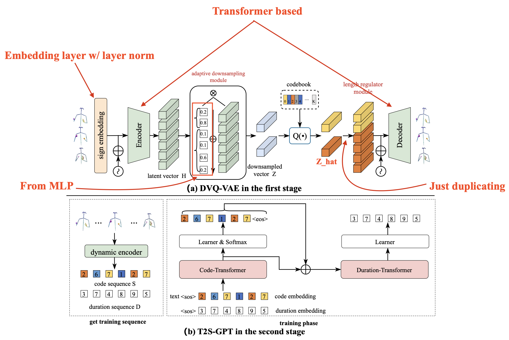

# Research history

## [x] Text-2-Sign GPT (Yin, 2024)

- for comparison, can we use the bigger VAE module in T2M-GPT
- The way they compare to T2M-GPT is wierd
  - They use expected downsampling rate for theyown, and T2M-GPT are 4 and 12. Which are quite different.
- Might be improved with human joint constraint (e.g. to prevent from broken finger movement, etc.)

### Architecture

#### DVQ-VAE

- codebook size : `(512, 512)`
- codebook K : `1024`
- transformer layer : `6`
- hidden size : `512`
- head size : `8`
- FF dimension : `2048`
- batch size : `256`
- exponential moving constant : `0.99`

#### T2S-GPT

- hidden size : `1024`
- head size : `16`
- FF dimension : `4096`
- transformer layer (code) : `18`
- transformer layer (dura) : `6`
- batch size : `256`

## [ ] T2M-GPT (Zhang, 2023b)

- Project link : [link](https://mael-zys.github.io/T2M-GPT/)
- add copuptable input in training steps
  - this is the key to archeive the SOTA result
- employ the common training recipes
- no language translation auxiliary loss like the T2S-GPT
- use CLIP as text encoder

### Architecture

#### VQ-VAE

- codebook size : `(512, 512)`
- downsampling rate : `4`
- T : `64`
- -> latent length : `64/4 = 16`
- training
  - batch size : `256`
  - exponential moving constant : `0.99`
  - iteration : `300k` (14 hr. on 32Gb V100)

#### T2M-GPT

- transformer layer : `18`
- hidden size : `1024`
- head size : `16`
- training
  - batch size : `128`
  - iteration : `300k` (78hr. on 32Gb V100)

## [ ]T2M-GPT+ (Zhang, 2024) 9 month ago

- Project link : [link](https://mael-zys.github.io/T2M-GPT/vis_extend.html)

## [ ] TM2-T (Guo, 2022)

## [ ] VQ-VAE2 (Razavi, 2019)

- Common trainning recipes
  1. Exponential moving average of the codebook
     - ?
  2. Codebook reset
     - ?
